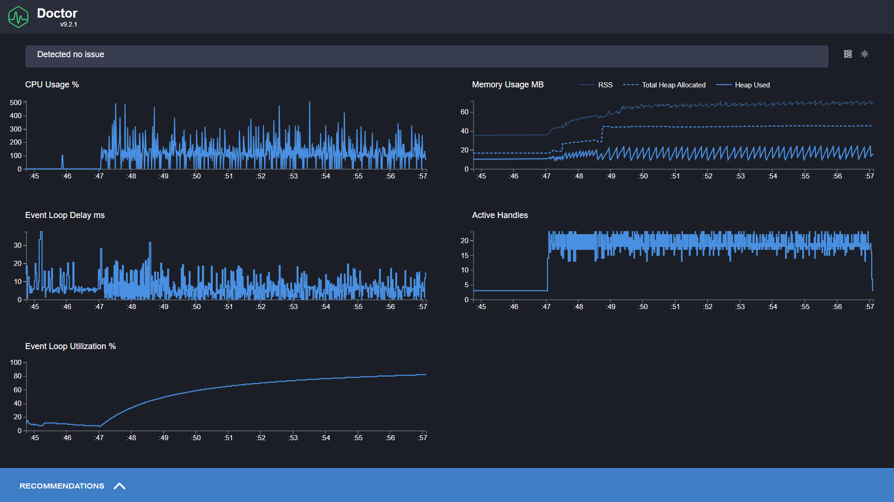

Project status:

-   🔧 In maintenance mode
    -   New features will not be added.
    -   A best-effort attempt will be made to keep the current functionality working and to fix significant bugs.
-   🔒 Not looking for code contributions from other developers

# ical-vacation-filter

Take an Outlook iCal feed and keep only the out-of-office events.

Filtered feed URL: `https://ical-vacation-filter.fly.dev/filter?source=%source_feed_URL%`.

It is recommended to encode the source feed URL using EncodeURIComponent.

Note: If you struggle to get your favourite calendar software to subscribe to the resulting feed URL, try putting the URL behind a URL shortener.

## Development

You can run the application with automatic restarts using `npm run start`.

The most interesting part of the code is the stream processing part:

-   We get the source data from `axios` as a stream
-   We use async iterator syntax to iterate over the source stream
-   We inspect the first chunk of the stream to perform sanity checks _before_ setting response headers
-   We use an async generator function to create the final filtered stream

The use of streams allows us to keep memory overhead as small as possible when processing iCal content. It also allows us to reject non-iCal content without first having to download it. Meanwhile, the async iterator syntax and async generator function allow us to keep the data filtering code relatively simple and readable.

If you believe all of this is too complex given the simple use case and you prefer short code that doesn't care too much about error handling and performance, take a look at [the first commit](https://github.com/mistermicheels/ical-vacation-filter/tree/77874535e9a5d0bfcda5da9148b0e608291a2fe4).

## Performance testing

Automated performance tests can be run using the `performance-test:<SCENARIO>` npm scripts.

Currently supported scenarios:

-   `ical-data`: Source returns iCal data
-   `binary-data`: Source returns binary data instead of iCal data
-   `binary-data-ical-header`: Source incorrectly returns binary data with iCal Content-Type header instead of iCal data

Example CLI output:

```
ical-vacation-filter>npm run performance-test:binary-data-ical-header

> ical-vacation-filter@0.0.1 performance-test:binary-data-ical-header
> clinic doctor --on-port 'node performance-test --scenario binaryDataWithIcalHeader' -- node src/index.js

Running on port 3000
Starting mock source server on port 8080
Load testing using autocannon
Completed 2490 requests using 10 connections during 10 seconds
Minimum latency: 16
Maximum latency: 117
Shutting down mock source server
Analysing data
Generated HTML file is file:///<REPO FOLDER>/.clinic/12000.clinic-doctor.html
```

Example visual output:



If you like to perform functional testing or other kinds of performance testing, you can expose the mock source servers for the different scenarios using the `mock-source-server:<SCENARIO>` npm scripts.
